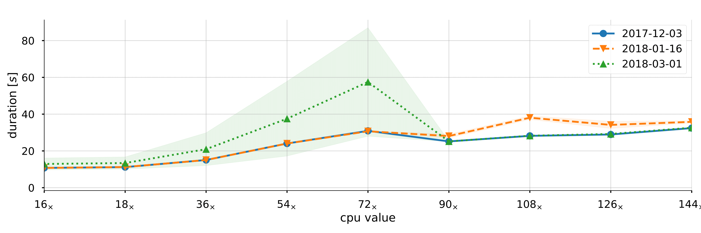

# CI&HPC framework

A *simple* framework which can monitor the performance and scalability of a software package.
The framework presented here combines *Continuous Integation* & *High Performance Computing* together with a minimalistic set of Python scripts.

see the following files:
  - [`bin/cihpc`](bin/cihpc)
  - [`cfg/hello-world/config.yaml`](cfg/hello-world/config.yaml)
  - [`cfg/hello-world/variables.yaml`](cfg/hello-world/variables.yaml)

## Prerequisites
Before configuring anything, make sure you have:
  1. an access to the HPC node (login preferable via `SSH Key-Based Authentication`).
  2. an access to a CI server such as Jenkins or other similar tool. If you have no such server available, `CRON` *may* suffice.

  3. an access to the database server, for now only MongoDB is supported. You can get free hosting on [MongoDB Atlas](https://www.mongodb.com/cloud/atlas) for up to 500MB.

  4. an access to a jupyter notebook server for visualisation. For education purposes [Azure notebooks](https://notebooks.azure.com) is possible option.

  *Note:* Jenkins server, Database server and visualisation server can be a single computer.

## Documentation
Read full docs [here](doc)

## Result from the framework

