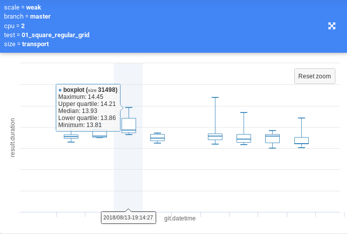
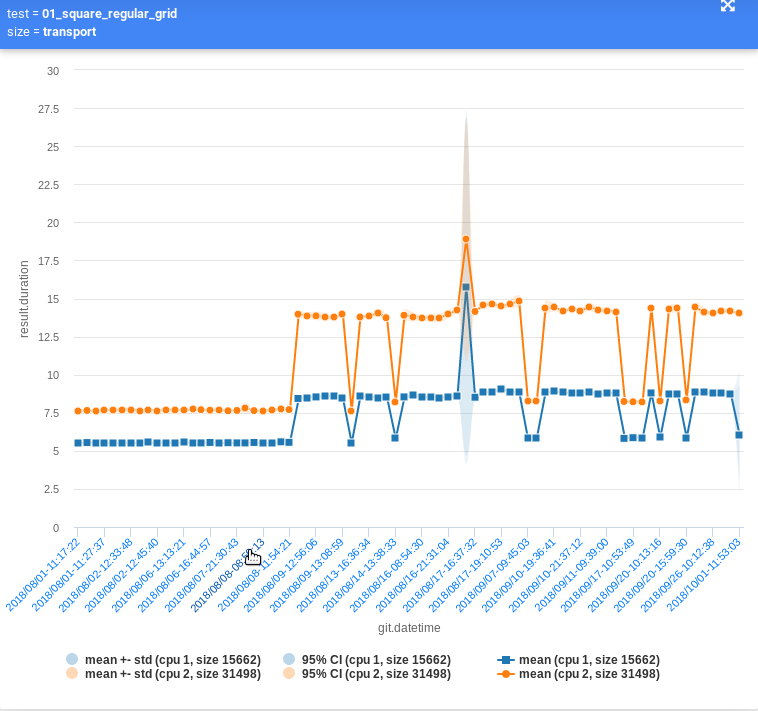

# CI & HPC &middot;      

A *simple* framework which can monitor the performance and scalability of software packages.
The framework presented here combines *Continuous Integation* & *High Performance Computing*
together with a minimalistic set of Python scripts.
The results can be visualised in form of static Jupyter notebook or in an interactive web page.

## Features
 - automatically run benchmarks of your project
 - inspect performance and scalability of your project
 - create complex configurations with travis syntax build matrix capabilities
 - use entire computing node with parallel test processing
 - automatically browse a commit history and run the benchmarks
 - automatically determine which tests to run based on results in your database

## Coming soon
 - simplify entire structure with a github push webhook
 - run extra tests when suspecting significant performance change
 - easily create web visualisation configuration from analyzing records in database

## CI-HPC showcase

### Interactive website

- 
- 
- 
- 

## Documentation & Installation
Read the docs at [ci-hpc.readthedocs.io](https://ci-hpc.readthedocs.io/en/dev/) to know more about installation.
