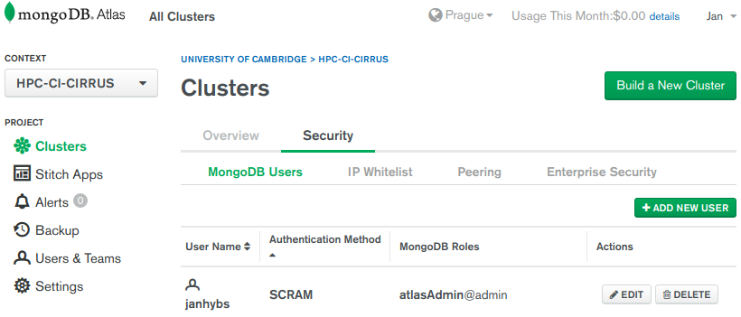
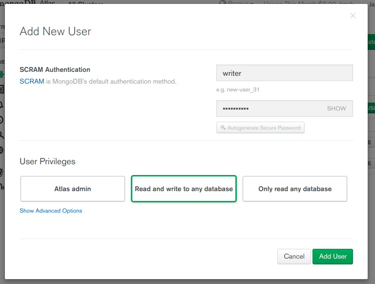

## MongoDB configuration

Configuring MongoDB storage is basically just creating an user, which has 
permissions to read and write to a database.

When using [MongoDB atlas](https://cloud.mongodb.com) you setup your project.
By default you should have (or you should be asked to add) a user, which is in role of a admin.



It is recommended to add another user, who can write to any database:



After the user is created you need to create a file `secret.yaml` inside
`cfg` directory. **Make sure only owner can read this file** as it will contain username, password and server to the MongoDB database.

## `secret.yaml` structure

Main section `pymongo` can contain several options. All of which are passed
to the construcotr of the python's 
[pymongo.mongo_client.MongoClient constructor](https://api.mongodb.com/python/current/api/pymongo/mongo_client.html#pymongo.mongo_client.MongoClient). Please refer to [api.mongodb.com](https://api.mongodb.com/python/current/api/pymongo/mongo_client.html#pymongo.mongo_client.MongoClient) for further information.

  1. Example 1 (single host):
      ```yaml
      pymongo:
          host:           [mongodb.server.example.com:27017]
          connect:        true
          authSource:     admin
          username:       writer
          password:       password-here
      ```

  2. Example 2 (mongodb configuration with 3 hosts):
      ```yaml
      pymongo:
          host:
            - cluster0-shard-00-00-foobar.mongodb.net:27017
            - cluster0-shard-00-01-foobar.mongodb.net:27017
            - cluster0-shard-00-02-foobar.mongodb.net:27017
          replicaSet:     Cluster0-shard-0
          connect:        true
          authSource:     admin
          authMechanism:  SCRAM-SHA-1
          ssl:            true
          username:       writer
          password:       password-here
      ```
